# Amazon_Vine_Analysis

## Objective

- The objective of this project is to analyze Amazon reviews written by members of the paid Amazon Vine program.
- Perform the ETL process to extract the dataset, transform the data, connect to an AWS RDS instance, and load the transformed data to a PostgreSQL database.
- Determine if there is any bias toward favorable reviews from Vine members.

### Tools

- Python:
  - PySpark
- SQL (PostgreSQL)
- Google Colab

## Results

### Selected theme

- The **US PC's reviews** theme was selected for this analysis
  - The dataset had **6,908,554 registers**
  - With the following structure:
    - marketplace
    - customer_id
    - review_id
    - product_id
    - product_parent
    - product_title
    - product_category
    - star_rating
    - helpful_votes
    - total_votes
    - vine
    - verified_purchase
    - review_headline
    - review_body
    - review_date
  - Source: <https://s3.amazonaws.com/amazon-reviews-pds/tsv/amazon_reviews_us_PC_v1_00.tsv.gz>

### ETL to AWS database

- A **PostgreSQL** database was created in AWS using the following structure: [schema](./resources/sql/schema.sql)
- Using the following code the database was retrived from an **AWS S3** service and appended to the PostgreSQL database in AWS: [Amazon Reviews ETL](./resources/final_code/Amazon_Reviews_ETL.ipynb)

#### Customers table

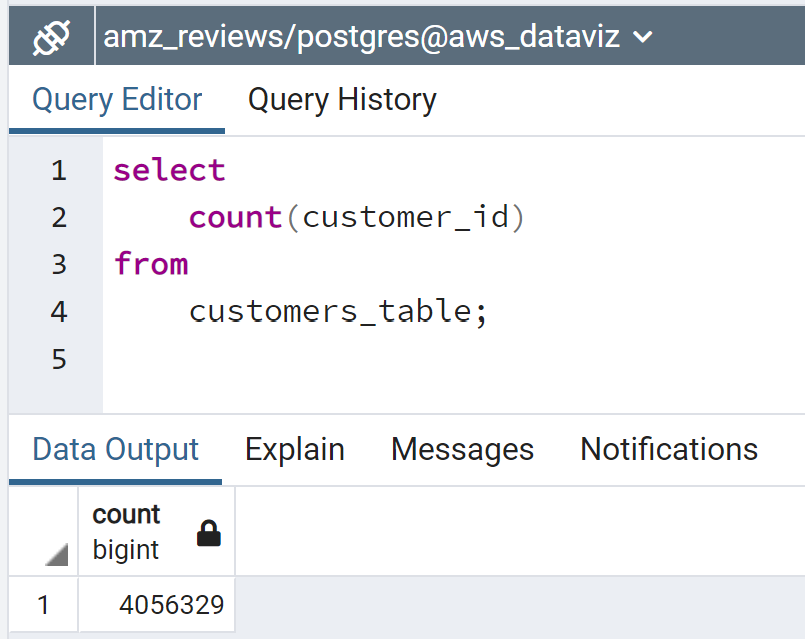

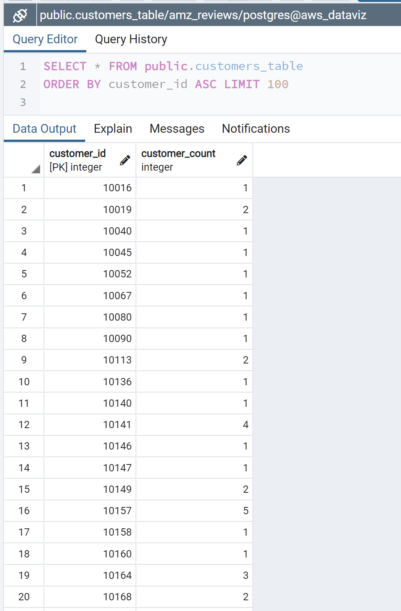

#### Products table

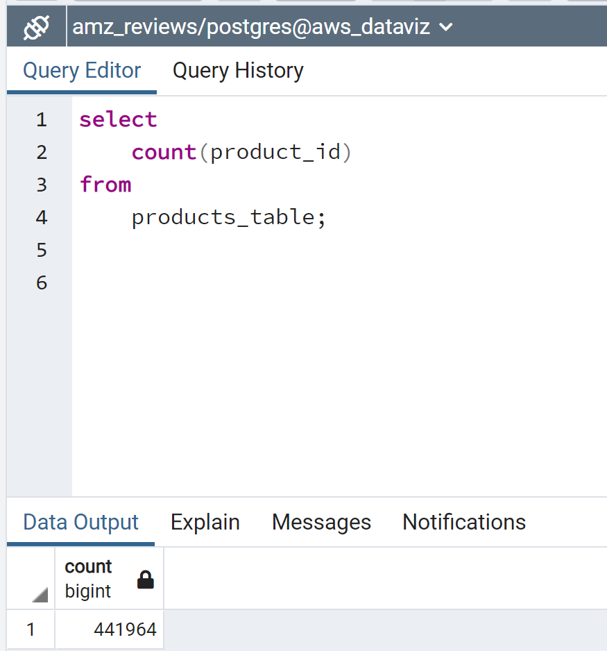

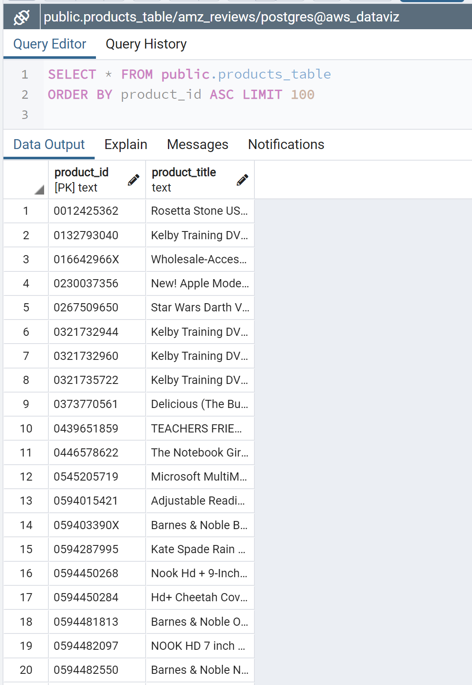

#### Reviews table

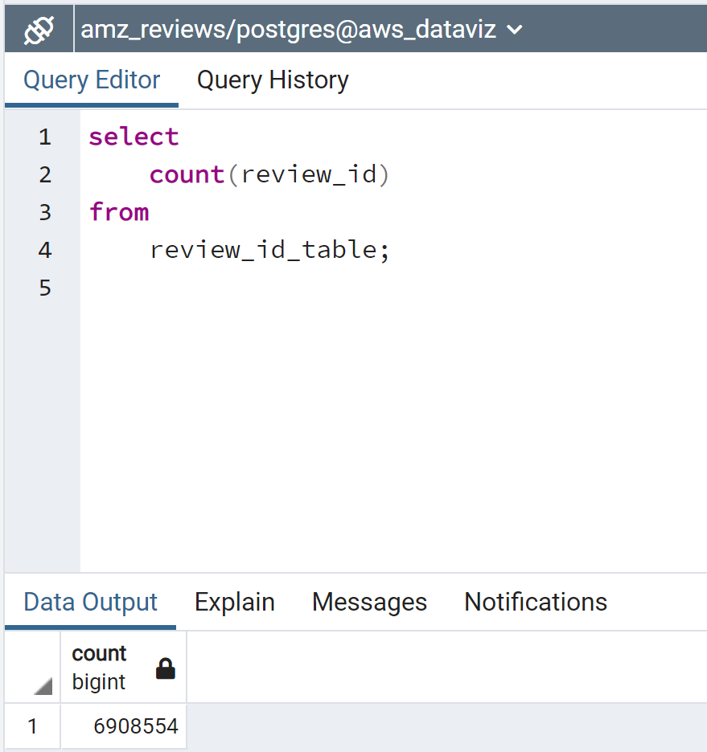

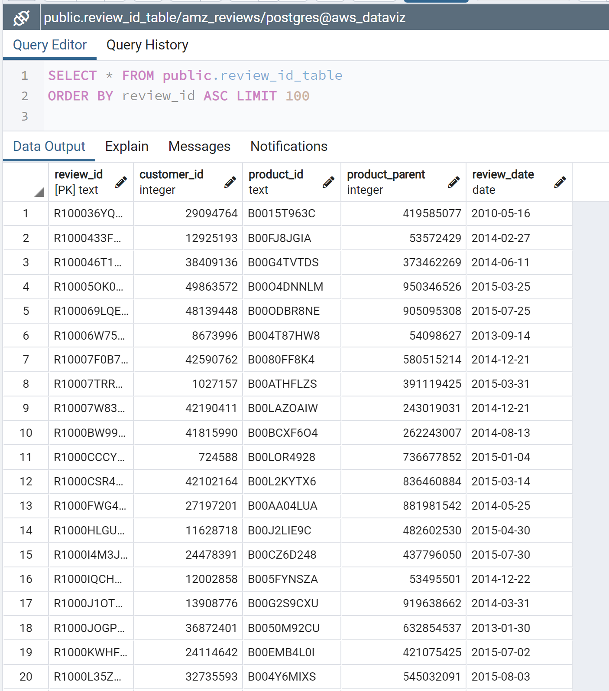

#### Vine table

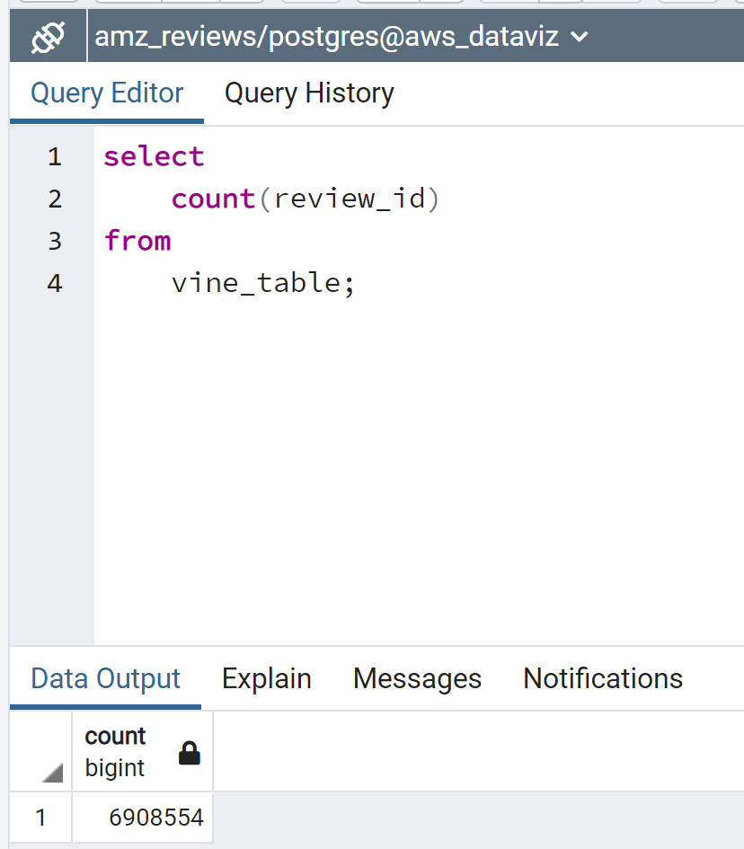

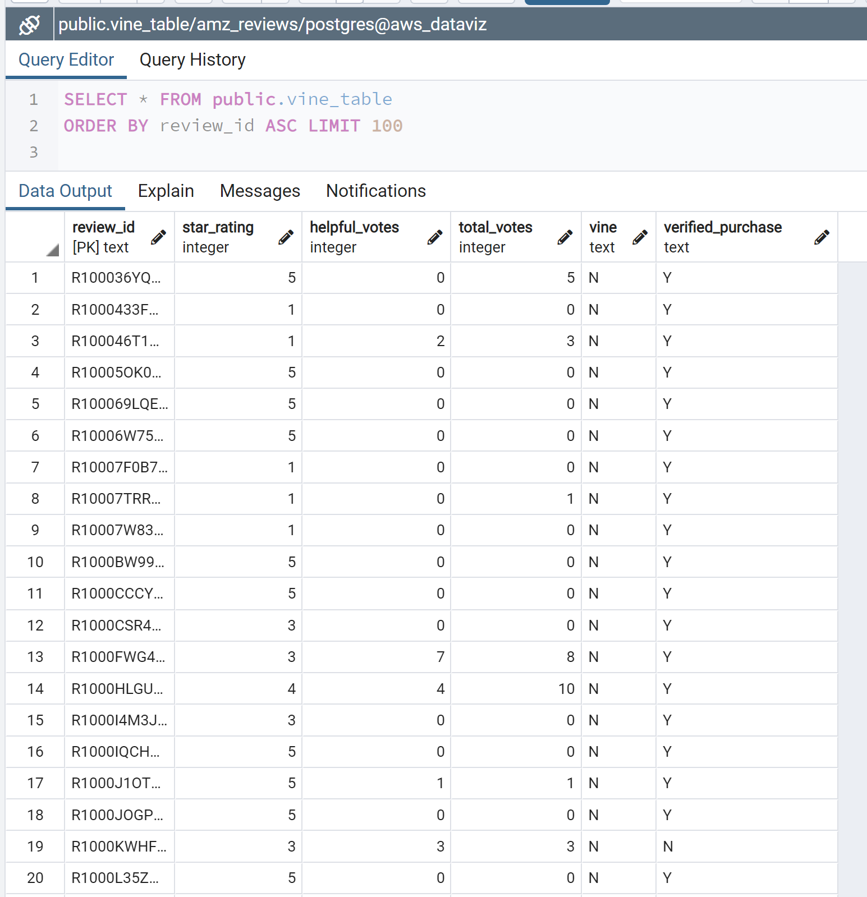

### Vine reviews analysis

- How many Vine reviews and non-Vine reviews were there?
  - There where a total of **6,908,554** reviews in the database
  - Without any filter **99.48%** of all reviews are unpaid
  - 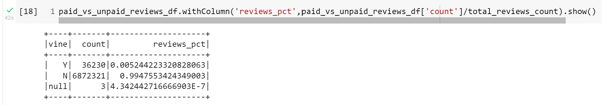
  - From this universe of **6,908,554** reviews:
    - Only **96,163** had at least 20 votes (highly voted reviews)
    - And from these highly voted reviews, **79,160** had a ratio of helpful over total votes equal or higher to 50% (referred as valued and helpful reviews)
      - In these selected reviews **97.76%** were unpaid
      - 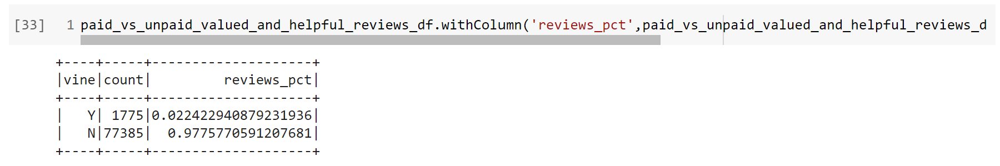

- How many Vine reviews were 5 stars? How many non-Vine reviews were 5 stars?
  - From the voted and helpful reviews **35,949** where unpaid (not from vine), and **783** were paid (from vine)
  - 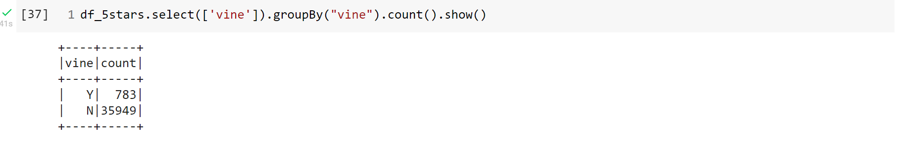
- What percentage of Vine reviews were 5 stars?
  - 44.11% of Vine reviews were 5 stars (783/1,775)
- What percentage of non-Vine reviews were 5 stars?
  - 46.45% fon non-Vine reviews were 5 stars (35,949/77,385)

## Summary

- The percentage of review that came from the Vine program (44.11%) is lower that the non-paid reviews (46.45%), this signals that Vine reviewers are more acid on its reviews that the general public.
- A Two-Sample t-test Analysis could be useful to give statistical support to this observation.
